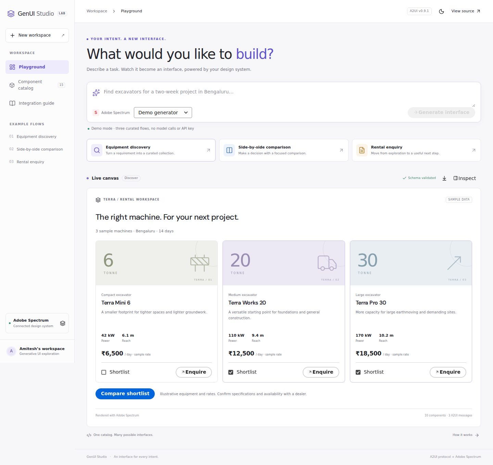

# GenUI Studio

A runnable generative UI example using **Google's A2UI v0.9.1 protocol** and **Adobe React Spectrum v3**. Describe an equipment-rental task and get an interactive discovery, comparison, or enquiry surface.



## Run locally

Requires Node.js 22.12+ and npm.

```bash
git clone https://github.com/iamitesh/GenUi.git
cd GenUi
npm ci
npm run dev
```

Open http://127.0.0.1:5173. **Demo generator** runs without credentials and makes no model calls. Fonts are bundled locally.

Try these prompts:

- `Find excavators for a two-week project in Bengaluru`
- `Show smaller excavators in Ranchi for 7 days`
- `Compare my shortlisted machines side by side`
- `Prepare a rental enquiry for my project`

The demo deliberately selects and parameterizes three curated flows; it is not an LLM. The fictional Terra equipment, specifications, rates and availability labels are fixtures, not Caterpillar data or live inventory. Enquiries are session-only drafts and are never sent externally.

## What is included

| Example | Working interactions |
| --- | --- |
| Discovery | Responsive equipment cards, shortlist toggles, compact-machine refinement, location and duration parsing |
| Comparison | Shortlist-based Spectrum table, daily rates, duration-based sample estimates |
| Enquiry | Two-way bound fields, contact validation, review dialog, local draft |

The playground includes light/dark modes, mobile layouts, a component catalog, message/data/action inspection, and JSON export of the current surface including local edits. Selections and form drafts survive flow changes. Invalid generated output leaves the last valid design intact.

View the [five rendered designs](docs/DESIGNS.md), [architecture](docs/ARCHITECTURE.md), and [adapter guide for shadcn/ui and MUI](docs/ADDING_A_DESIGN_SYSTEM.md).

## Real generation with Gemini

1. Copy `.env.example` to `.env.local`.
2. Set `GEMINI_API_KEY` and optionally `GEMINI_MODEL` to a JSON-capable Gemini model available to your account. The example default is `gemini-2.5-flash`.
3. Restart `npm run dev`, select **Gemini · API key**, and enter a prompt.

The development server sends your prompt, current workspace data and the catalog to Gemini. It validates the entire generated batch before returning NDJSON to the browser. The API key stays on the server. This is **validated message replay after model completion**, not token-level streaming.

The live provider path has automated mocked-response tests. A real Gemini generation has not been verified because no API key was supplied. There is no silent fallback to demo results if the provider fails.

The model endpoint is intentionally **local development only**. `npm run build` produces a static demo; `npm run preview` does not expose the Gemini endpoint. For production, port the handler to an authenticated server, add per-user quotas and durable storage, and connect authorized inventory tools.

## A2UI compatibility

This repository implements a **custom, bounded A2UI renderer**, not the `@a2ui/react` SDK. It vendors the unmodified upstream v0.9.1 server/client envelope schemas and registers an application-owned, 15-component catalog. Catalog components are rendered using real Adobe Spectrum controls.

Supported: `createSurface`, `updateComponents`, `updateDataModel`, `deleteSurface`, root ID `root`, absolute JSON Pointer bindings, local two-way form binding, explicit event actions, incremental data/component updates, and catalog validation.

Outside this example: the Google Basic Catalog, function calls, relative/template bindings, A2A or AG-UI transport bindings, automatic `sendDataModel` synchronization, runtime code generation, and arbitrary component creation. Unsupported capabilities fail explicitly. `v0.9.1` is pinned; newer protocol versions must be reviewed before adoption.

The runtime supports incremental updates. The playground stages each newly generated design until it is complete so malformed output cannot replace the current interface. Ordinary edits update local state without re-generating components.

## Adding another design system

The separation is explicit:

```text
src/a2ui/             protocol, validation, state, generic renderer
src/adapters/         adapter contract and Adobe Spectrum implementation
src/examples/         fixture data and example compositions
src/agent/            demo and HTTP transport interfaces
server/              optional Gemini development endpoint
catalogs/            exported machine-readable component schema
examples/            ready-to-replay A2UI JSON messages
```

Implement `DesignSystemAdapter` with a theme provider and a mapping for every catalog component. MUI and shadcn/ui are documented extension targets; **their adapters are not implemented yet**. The agent and message format can stay unchanged when the new adapter supports the same catalog semantics.

## Verify and regenerate assets

```bash
npm run check              # unit/server tests, TypeScript, production build
npx playwright install chromium
npm run test:e2e           # full journey, refinement, state, errors, mobile
npm run examples           # regenerate catalog and sample A2UI JSON
npm run capture:designs    # capture actual desktop, dark and mobile screens
```

For an existing Chromium installation, set `CHROMIUM_EXECUTABLE_PATH` when running browser checks or capture. The lockfile pins all dependency versions. The initial production bundle is approximately 280 KB of gzipped JavaScript plus 50 KB of gzipped CSS; this is an exploration starter, not a production performance baseline.

## Sources and attribution

- [A2UI v0.9.1 specification](https://a2ui.org/specification/v0.9.1-a2ui/)
- [Defining an A2UI catalog](https://a2ui.org/guides/defining-your-own-catalog/)
- [Adobe React Spectrum v3](https://react-spectrum.adobe.com/v3/getting-started.html)
- [Gemini generateContent API](https://ai.google.dev/api/generate-content)

Upstream schema attribution and license: [THIRD_PARTY_NOTICES.md](THIRD_PARTY_NOTICES.md). This is an independent example, not an official Adobe or Google product.
