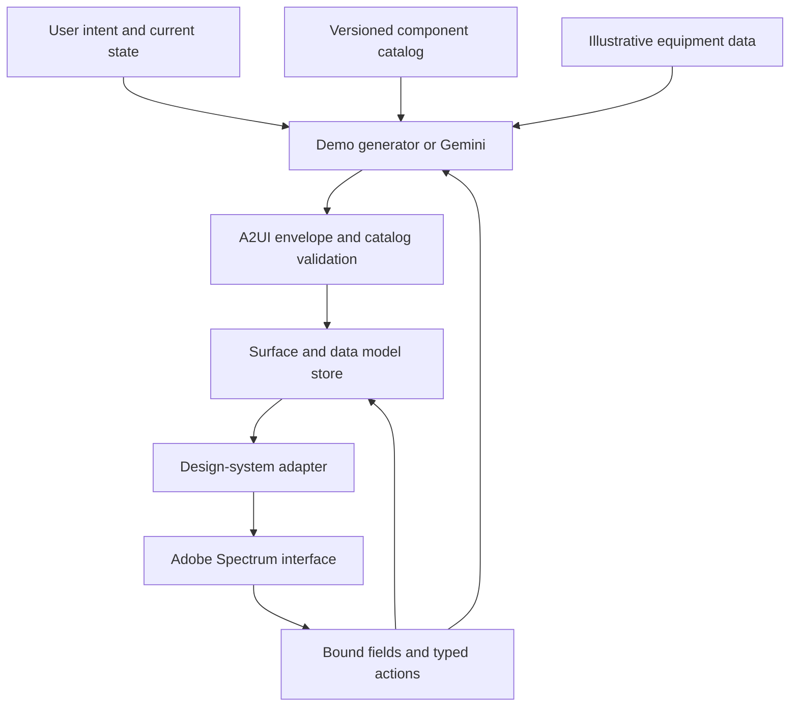

# Architecture and decisions

## Data flow

The Google protocol describes surfaces and updates. Our catalog defines what the agent may compose. Adobe Spectrum supplies controls, keyboard behavior and theme-aware component implementations. Application CSS owns page layout and domain compositions; the agent cannot send CSS or executable code.

## Boundaries

| Boundary | Contract | Current implementation |
| --- | --- | --- |
| Protocol | A2UI v0.9.1 message envelopes | Vendored upstream JSON Schema, validated by Ajv 2020 |
| Catalog | 15 discriminated component definitions | `src/a2ui/catalog.ts`, exported as JSON |
| Runtime | Immutable surface state and absolute path updates | `src/a2ui/runtime.ts` |
| Renderer | Stable component IDs and a component mapping | `src/a2ui/Renderer.tsx` |
| Design system | `DesignSystemAdapter` including Provider | Adobe React Spectrum v3 |
| Agent | `generate(request, signal): AsyncIterable<Message>` | Curated demo generator; optional Gemini HTTP transport |
| Business actions | Allowlisted named events and resolved context | Shortlist, compare, enquiry, review; session draft |

## Decisions

1. **Use a custom catalog rather than pretend the Google Basic Catalog maps automatically.** `EquipmentCard` and our `Text`, `Button`, etc. have application-defined schemas. Catalog identity determines compatibility. Adding an adapter requires implementing the same behavior, including domain compositions.
2. **Use the A2UI protocol directly with a small custom renderer.** This makes the boundaries easy to inspect and extend. The original envelope schemas remain unchanged, including their upstream `/v0_9/` schema ID. The catalog alias resolves their `catalog.json` reference to our local schema. This is not a full renderer SDK replacement.
3. **Keep business information in fixtures and state.** The demo uses fictional equipment; the card renderer only accepts known IDs. Gemini-generated free text is still model output and must not be treated as verified business data. A production agent must use authorized tools and bind authoritative results into the data model.
4. **Separate local edits from agent generation.** A checkbox or input immediately updates the data model. Stable IDs retain field identity. Explicit actions resolve bound context at dispatch time.
5. **Commit complete generated designs atomically.** The runtime processes incremental updates. The playground stages a new generation and finalizes graph/data validation before committing it. Stop, network failures and schema failures preserve the prior surface.
6. **Treat the provider as replaceable.** The optional local Gemini handler requests JSON, validates the complete response, then emits NDJSON. A different server/model only needs to satisfy the same transport contract. It must not change the renderer.

## Guardrails in this sample

- Strict component and envelope properties; no arbitrary JSX, HTML, imports, URLs, styles or functions.
- Known catalog IDs, known event names, validated component IDs and existing action sources.
- Surface lifecycle validation, graph cycle/expansion/depth limits, duplicate ID and child checks, completed-root validation.
- Absolute JSON Pointer decoding, dangerous-key rejection, payload/message limits and immutable upsert/replacement/delete semantics.
- Unknown, incomplete or invalid generated output is rejected before it replaces the current interface.
- Local-only, same-origin Gemini endpoint; two concurrent requests at most, prompt/body bounds, timeout and cancellation; no API key in the browser.
- A bounded session trace and current-state JSON export. Trace and local drafts disappear on refresh; export may include the contact details entered into the form.

These controls constrain rendering. They are not a guarantee of model truthfulness or a replacement for production authorization, rate limits, user consent, tool permissions and source provenance.

## Protocol subset

| Capability | Behavior |
| --- | --- |
| Surface create/delete | Supported; duplicate creates and updates before creation fail |
| Component updates | Upsert by ID; forward references permitted until finalization |
| Data updates | Replace at a pointer; omitted value deletes; root replacement at `/` |
| Binding | Absolute pointers only; `~0` and `~1` decoding supported |
| Actions | v0.9.1 client event envelope with timestamp/source and resolved context |
| Surface theme | Optional `colorScheme` supplied to adapter Provider; host theme inherited otherwise |
| Relative/template binding | Not supported |
| Function calls | Not supported |
| `sendDataModel: true` | Rejected; explicit context is used instead |
| Unknown version or catalog | Rejected |

## Next increments

1. Implement the next adapter and replay the existing three JSON examples through it. Share behavior checks across adapters.
2. Add a reviewed component spec and renderer implementation before extending the catalog; version breaking semantics explicitly.
3. Replace fixtures with inventory and dealer tools, source timestamps and region metadata.
4. Move the Gemini handler into an authenticated service, add user quotas, durable sessions and trace redaction.
5. Add a live-provider acceptance suite using secured test credentials, and evaluate latency, validity, accessibility and task completion.

No Figma file was provided. The designs in this repository are screenshots of the running code. A later Figma/Code Connect pipeline can map approved design components to this versioned catalog at development time.
