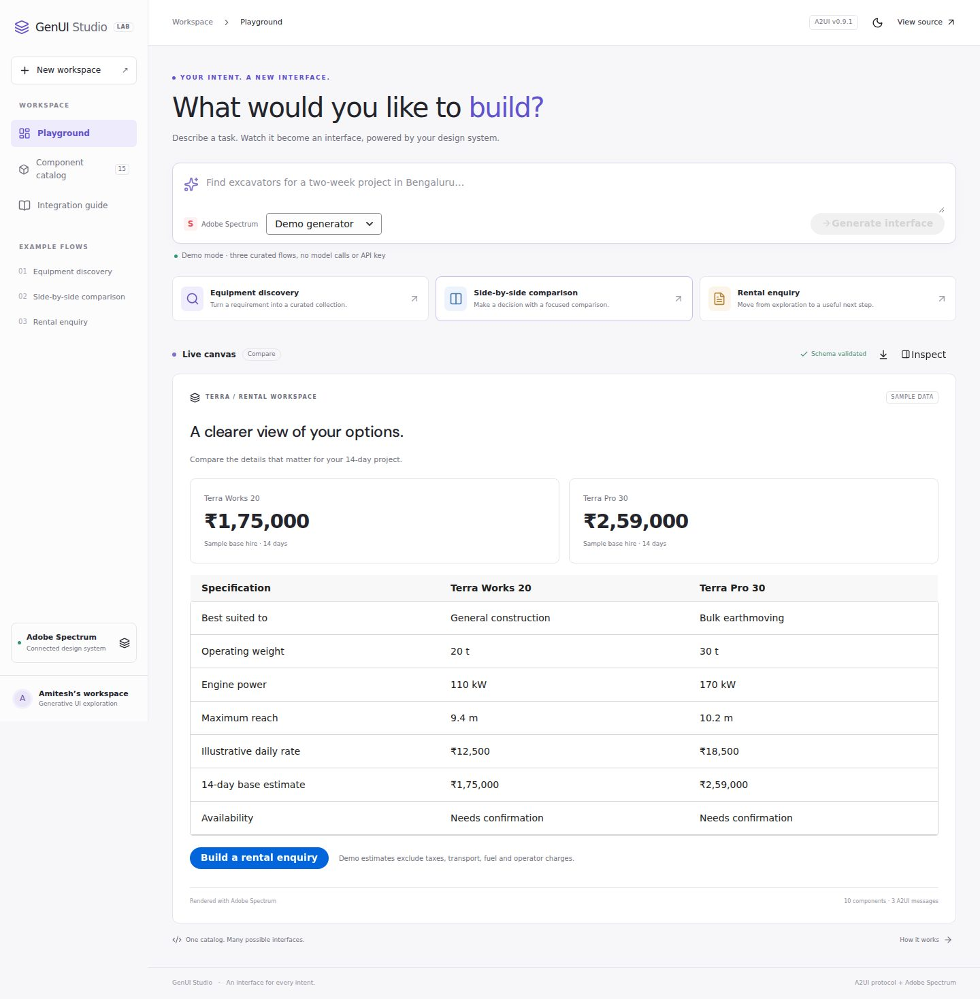
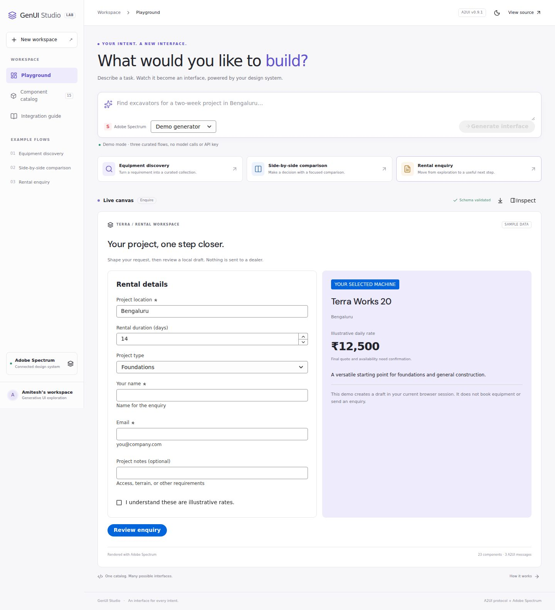
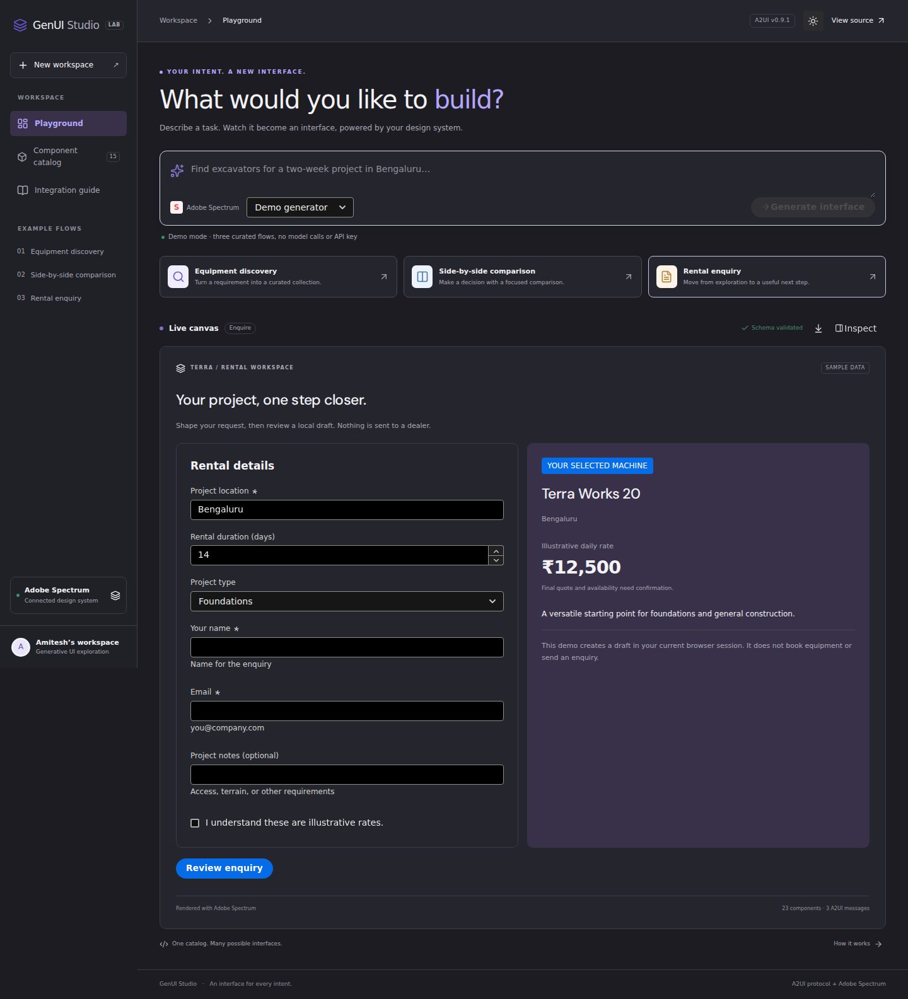
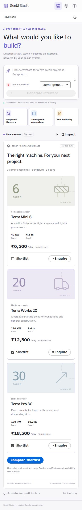

# Rendered example designs

These are captures of the working implementation, not conceptual mockups. The canvas uses Adobe Spectrum controls and a shared application catalog. Fictional Terra equipment keeps the example independent of live manufacturer data.

## 1. Discovery

A prompt composer leads into a responsive collection with machine summaries, shortlist controls and enquiry actions.

## 2. Comparison

Shortlisted equipment becomes a focused table and duration-based sample estimates.

## 3. Enquiry

A bound form preserves project context and adds an explicit review step before saving a local draft.

## 4. Dark theme

## 5. Mobile

Navigation becomes compact; examples and cards remain usable at 390px width.

Regenerate after UI changes with `npm run capture:designs`.
